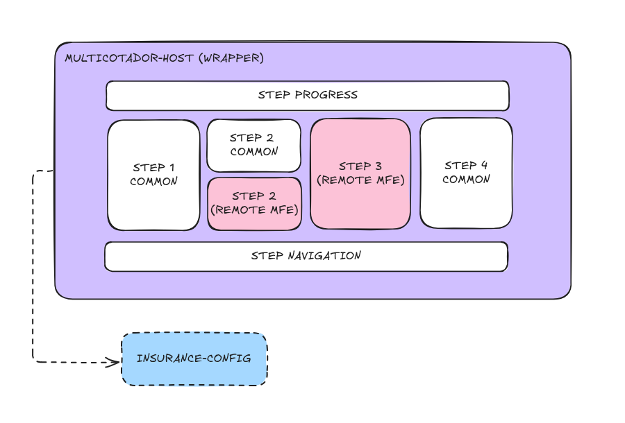

# 🏗️ Insurance quote system with dynamic micro frontends

A **Proof of Concept** demonstrating **Webpack 5 Module Federation** with dynamic remote loading for multi‑product insurance quotes. Each product runs as an independent micro frontend (MFE) that can be developed, deployed, and scaled autonomously.

---

## ✨ Key features

### 🔄 Dynamic Module Federation

- **Runtime remote loading** — Add products without rebuilding the host
- **YAML-based configuration** — Centralized product registry (source of truth)
- **Independent deployment** — Deploy products without coordinating releases
- **Automatic discovery** — Products appear in UI based on the config file

### 🏪 State management

- **Redux Toolkit** — Shared state between host and MFEs
- **Singleton pattern** — Single store instance across all applications via Module Federation shared deps
- **Type‑safe** — Full TypeScript support with automatic inference

### 📋 Multi‑step quote flow

1. **Step 1 (Host):** CPF + product selection
2. **Step 2 (Hybrid):** common fields (name, email, phone) + product‑specific fields (remote)
3. **Step 3 (Product MFE):** product‑specific form (remote)
4. **Step 4 (Host):** final summary

### 🦺 Insurance products

- **Auto Insurance** — license plate, driver’s license, vehicle details
- **Home Insurance** — postal code, property type, area, security features
- **Extensible** — add new products via configuration without host rebuild

---

## 🧭 Overview

Multi‑product quote system where each type of insurance (Auto, Home, etc.) is built and deployed independently as a **Microfrontend**. The app works as a single wizard with **4 steps**, where **steps 2 and 3** change according to the selected product. The main idea is to let different teams work on different products without coordinated deploys, and to add new products without touching the host.



---

## ✅ Requirements (summary)

### Functionality

- A **4‑step wizard** with progressive data entry
- **Step 1** is always the same (CPF + product choice)
- **Step 2** has **common fields** at the top and **product‑specific fields** below
- **Step 3** is **completely different** per product
- **Step 4** is always the same (final summary)

### Architecture

- **Each product lives in a separate repository**
- Teams work independently on different products
- A product deploy must **not** affect the others
- We must be able to **add a new product without rebuilding the host**
- Everything happens on **one page**, no route changes

### Technical constraints

- Must use **Webpack (not Vite)**
- **React 18+** stack

---

## 🧱 Architecture

### Host (MFE wrapper)

- Renders the global layout (header, footer, navigation)
- Controls **Step 1** (CPF + product selection)
- Renders **common fields** in **Step 2**
- **Dynamically loads** product components for **Step 2** and **Step 3**
- Controls **Step 4**
- **Exposes `useCotacaoStore`** via Module Federation so MFEs can read/update the global state

### Product MFEs (auto‑mfe, home‑mfe, etc.)

- Own repository and deploy pipeline
- **Expose two components:** `Step2` (hybrid step) and `Step3` (custom step)
- **Consume** `useCotacaoStore` from the host to read/write data

### Config repo

- Maintains **`config.yaml`** as the source of truth
- CI/CD script converts **YAML → JSON**
- Controls which products are available and their URLs

---

## 🔗 Application flow

```
Step 1 (Host)
  ↳ user selects product
Step 2 (Hybrid)
  ↳ host renders common fields (name, email, phone)
  ↳ host dynamically loads product Step 2 (remote) → product fields
Step 3 (MFE)
  ↳ host dynamically loads product Step 3 (remote)
Step 4 (Host)
  ↳ host reads all data (in‑memory Redux store) and renders summary
```

---

## 🧰 Why Webpack + Module Federation (and not single‑spa)

- **Module Federation is native** to Webpack 5. The host can load components from other repos **at runtime**, and each MFE can be developed and deployed independently.
- **Simpler than single‑spa** for this scenario: we have a single page/wizard and **no cross‑MFE routing**. `single‑spa ` would add orchestration complexity.
- **Shared code as singletons** (React, React‑DOM, Redux) to avoid duplication and hook issues. **Lazy loading** ensures we only load a product’s code when it is selected.
- **Trade‑off:** dynamic `remotes` requires a small custom runtime loader fed by a config file.

---

## 🧵 State sharing: Redux Toolkit

We evaluated three approaches before landing on Redux Toolkit.

### What went wrong with Zustand + Webpack

- In Vite, Zustand works great and we validated a full POC (repo: `https://github.com/ChristySchott/insurance-mfe`).
- In **Webpack**, Zustand **does not keep a singleton** across MFEs even when configured in `shared`. Each app instantiates its own store, leading to **duplicated and desynced state** (documented in the [community discussions](https://github.com/pmndrs/zustand/discussions/1881)).

### What went wrong with `sessionStorage` + `BroadcastChannel`

We tried storing state in `sessionStorage` and notifying changes via `BroadcastChannel` / `CustomEvent`:

- **Race conditions** during fast step navigation (reading intermediate/old states)
- **Growing complexity** (flags, timestamp validation, debouncing, origin tracking)
- **Performance & re‑renders** (custom selectors, deep comparisons, manual memoization)
- **Security** (no protection at rest; future encryption would spread logic across reads/writes)
- **Hard debugging** (no native tooling; many ad‑hoc logs)
- Event‑based sync keeps **multiple serialized copies** across apps → **latency, drift, and exposure**.  
  A **shared in‑memory reference** (Redux via Module Federation) ensures a **single**, **instant**, **confined** source of truth.

### The solution: Redux Toolkit

- **Native singleton** under Module Federation when declared in `shared`
- **Centralized and synchronous** state (no async cross‑app messaging → no race conditions)
- **Familiar API** (close to our prior Zustand hooks)
- **Redux DevTools** (inspect state/actions, time‑travel)
- **Optimized performance** (Immer + memoized selectors)
- **Trade‑offs:** ~**+10 kB gz** vs. sessionStorage‑only; a `Provider` in the host; one extra dependency

#### Store (`src/store/cotacaoStore.ts`) — excerpt

```ts
import { createSlice, configureStore, PayloadAction } from "@reduxjs/toolkit";
import type { CotacaoState } from "@/types/cotacao";

const initialState: CotacaoState = {
  currentStep: 1,
  cpf: "",
  productType: null,
  productData: {},
  isCurrentStepValid: false,
};

const cotacaoSlice = createSlice({
  name: "cotacao",
  initialState,
  reducers: {
    setCurrentStep: (state, action: PayloadAction<number>) => {
      state.currentStep = action.payload;
    },
    setCpf: (state, action: PayloadAction<string>) => {
      state.cpf = action.payload;
    },
    setProductType: (state, action: PayloadAction<string | null>) => {
      state.productType = action.payload;
    },
    setProductData: (state, action: PayloadAction<Record<string, unknown>>) => {
      state.productData = action.payload;
    },
    setIsCurrentStepValid: (state, action: PayloadAction<boolean>) => {
      state.isCurrentStepValid = action.payload;
    },
    reset: (
      _state,
      action: PayloadAction<Partial<CotacaoState> | undefined>
    ) => {
      return { ...initialState, ...action.payload };
    },
  },
});

export const {
  setCurrentStep,
  setCpf,
  setProductType,
  setProductData,
  setIsCurrentStepValid,
  reset,
} = cotacaoSlice.actions;

export const store = configureStore({
  reducer: { cotacao: cotacaoSlice.reducer },
  middleware: (getDefaultMiddleware) =>
    getDefaultMiddleware({
      serializableCheck: { ignoredActions: ["cotacao/setProductData"] },
    }),
});

export type RootState = ReturnType<typeof store.getState>;
export type AppDispatch = typeof store.dispatch;
```

#### Hook (`src/hooks/useCotacaoStore.ts`) — excerpt

```ts
import { useDispatch, useSelector } from "react-redux";
import type { RootState, AppDispatch } from "@/store/cotacaoStore";
import {
  setCurrentStep,
  setCpf,
  setProductType,
  setProductData,
  setIsCurrentStepValid,
  reset,
} from "@/store/cotacaoStore";
import type { CotacaoState } from "@/types/cotacao";

const useAppDispatch = useDispatch.withTypes<AppDispatch>();
const useAppSelector = useSelector.withTypes<RootState>();

export const useCotacaoStore = () => {
  const dispatch = useAppDispatch();
  const state = useAppSelector((s) => s.cotacao);

  return {
    ...state,
    setCurrentStep: (step: number) => dispatch(setCurrentStep(step)),
    setCpf: (cpf: string) => dispatch(setCpf(cpf)),
    setProductType: (type: string | null) => dispatch(setProductType(type)),
    setProductData: (data: Record<string, unknown>) =>
      dispatch(setProductData(data)),
    setIsCurrentStepValid: (valid: boolean) =>
      dispatch(setIsCurrentStepValid(valid)),
    reset: (values?: Partial<CotacaoState>) => dispatch(reset(values)),
  };
};
```

#### Usage in host — excerpt

```ts
import React from 'react'
import ReactDOM from 'react-dom/client'
import { Provider } from 'react-redux'
import { store } from './store/cotacaoStore'
import App from './App'

ReactDOM.createRoot(document.getElementById('root')!).render(
  <React.StrictMode>
    <Provider store={store}>
      <App />
    </Provider>
  </React.StrictMode>
)
```

#### Usage in MFEs — excerpt

```ts
import { useCotacaoStore } from 'multicotadorHost/useCotacaoStore'

function Step2() {
  const { productType, productData, setProductData } = useCotacaoStore()
  // ...
  return <div>{productType}</div>
}
```

---

## 📦 Project structure (current)

```
.
├── apps
│   ├── auto-mfe
│   │   ├── index.html
│   │   ├── package.json
│   │   ├── src
│   │   │   ├── App.tsx
│   │   │   ├── bootstrap.tsx
│   │   │   ├── components
│   │   │   │   ├── FormField.tsx
│   │   │   │   └── ProductFormWrapper.tsx
│   │   │   ├── hooks
│   │   │   │   └── useProductForm.ts
│   │   │   ├── index.css
│   │   │   ├── index.ts
│   │   │   ├── lib
│   │   │   │   ├── data.ts
│   │   │   │   ├── format.ts
│   │   │   │   └── validation.ts
│   │   │   ├── steps
│   │   │   │   ├── Step2.tsx
│   │   │   │   └── Step3.tsx
│   │   │   └── types
│   │   │       └── remotes.d.ts
│   │   └── webpack.config.ts
│   ├── home-mfe
│   │   ├── index.html
│   │   ├── package.json
│   │   ├── src
│   │   │   ├── App.tsx
│   │   │   ├── bootstrap.tsx
│   │   │   ├── components
│   │   │   │   ├── FormField.tsx
│   │   │   │   └── ProductFormWrapper.tsx
│   │   │   ├── hooks
│   │   │   │   └── useProductForm.ts
│   │   │   ├── index.css
│   │   │   ├── index.ts
│   │   │   ├── lib
│   │   │   │   ├── data.ts
│   │   │   │   ├── format.ts
│   │   │   │   └── validation.ts
│   │   │   ├── steps
│   │   │   │   ├── Step2.tsx
│   │   │   │   └── Step3.tsx
│   │   │   └── types
│   │   │       └── remotes.d.ts
│   │   └── webpack.config.ts
│   ├── insurance-config
│   │   ├── environments
│   │   │   ├── config.dev.yaml
│   │   │   ├── config.prod.yaml
│   │   │   └── config.qa.yaml
│   │   ├── package.json
│   │   ├── schemas
│   │   │   └── config.schema.ts
│   │   ├── scripts
│   │   │   ├── convert-yaml-to-json.ts
│   │   │   └── validate-config.ts
│   └── multicotador-host
│       ├── eslint.config.js
│       ├── index.html
│       ├── package.json
│       ├── src
│       │   ├── App.tsx
│       │   ├── bootstrap.tsx
│       │   ├── components
│       │   │   ├── ErrorBoundary.tsx
│       │   │   ├── LoadingSpinner.tsx
│       │   │   ├── ProductOption.tsx
│       │   │   ├── ProductTypeSelector.tsx
│       │   │   ├── RemoteComponent.tsx
│       │   │   ├── StepProgress.tsx
│       │   │   └── steps
│       │   │       ├── Step1.tsx
│       │   │       ├── Step2.tsx
│       │   │       ├── Step3.tsx
│       │   │       ├── Step4.tsx
│       │   │       ├── StepWizard.tsx
│       │   │       ├── StepNavigation.tsx
│       │   │       └── StepProgress.tsx
│       │   ├── config
│       │   │   └── remoteConfig.ts
│       │   ├── hooks
│       │   │   ├── useCotacaoStore.ts
│       │   │   ├── useRemoteComponent.tsx
│       │   │   └── useRemoteProducts.tsx
│       │   ├── index.css
│       │   ├── index.ts
│       │   ├── lib
│       │   │   ├── format.ts
│       │   │   └── loadRemoteModule.ts
│       │   ├── store
│       │   │   └── cotacaoStore.ts
│       │   └── types
│       │       ├── cotacao.ts
│       │       └── remoteConfig.ts
│       │
│       └── webpack.config.ts
├── package.json
├── packages
│   ├── eslint-config
│   └── prettier-config
├── pnpm-workspace.yaml
├── README.md
└── turbo.json
```

---

## ⚙️ Dynamic remotes

Traditionally, Webpack Module Federation requires **static** `remotes` at build time:

```ts
new ModuleFederationPlugin({
  remotes: {
    autoMfe: "autoMfe@http://localhost:3001/remoteEntry.js",
    homeMfe: "homeMfe@http://localhost:3002/remoteEntry.js",
  },
});
```

That would force a host rebuild for every new product.  
**Our solution:** runtime remotes **fed by `config.json`** produced from YAML by CI/CD.

### `config.json` structure

```json
{
  "products": [
    {
      "id": "auto",
      "name": "Seguro Auto",
      "scope": "autoMfe",
      "url": "http://localhost:3002/remoteEntry.js",
      "enabled": true
    },
    {
      "id": "home",
      "name": "Seguro Residencial",
      "scope": "homeMfe",
      "url": "http://localhost:3001/remoteEntry.js",
      "enabled": true
    },
    {
      "id": "life",
      "name": "Seguro de Vida",
      "scope": "lifeMfe",
      "url": "http://localhost:3003/remoteEntry.js",
      "enabled": false
    }
  ]
}
```

- `id`: business identifier
- `name`: UI label
- `scope`: Module Federation container name (**matches `name` in the product's `webpack.config.ts`**)
- `url`: `remoteEntry.js` endpoint
- `enabled`: feature toggle per product

### How dynamic remote loading works

The system loads remote modules through a four-phase process:

#### 1. Script loading (`loadRemoteScript`)

Downloads the remote's JavaScript bundle and injects it into the DOM:

```typescript
function loadRemoteScript(url: string, scope: string): Promise<void>;
```

**Process:**

- Checks cache: Returns existing promise if script is already loading
- Checks DOM: Skips if script tag already exists
- Injects script: Creates `<script>` tag with `data-scope` and `data-url` attributes
- Handles errors: Cleans up failed scripts from cache and DOM
- Prevents duplicates: Caches loading promises to avoid parallel requests

**Example:**

```typescript
// Downloads http://localhost:3001/remoteEntry.js
await loadRemoteScript("http://localhost:3001/remoteEntry.js", "homeMfe");
// Result: <script data-scope="homeMfe" data-url="..." src="..."></script> added to DOM
```

#### 2. Container discovery (`waitForRemoteContainerToAppearOnWindow`)

Waits for the remote container to register itself on the window object:

```typescript
function waitForRemoteContainerToAppearOnWindow(
  scope: string
): Promise<RemoteContainer | null>;
```

**Why polling is necessary:**

- Script's `onload` fires when file downloads, not when code executes
- Remote container registration happens inside the script's execution
- No browser event signals when the container is ready

**Polling mechanism:**

- Checks `window[scope]` every 100ms
- Maximum 10 attempts (1 second total)
- Returns null if container never appears

**Timeline example:**

```
0ms:    Script onload fires ✓
100ms:  Check window.homeMfe → undefined ❌
200ms:  Check window.homeMfe → undefined ❌
250ms:  [remoteEntry.js finishes executing]
300ms:  window.homeMfe = { init, get } ✓
300ms:  Check window.homeMfe → Found! ✅
```

#### 3. Container initialization (`loadRemoteContainer`)

Orchestrates loading and initializes Module Federation sharing:

```typescript
async function loadRemoteContainer(
  url: string,
  scope: string
): Promise<RemoteContainer>;
```

**Process:**

- **Check cache:** Return cached container if already initialized
- **Load script:** Download and inject the remote bundle
- **Wait for container:** Poll until `window[scope]` exists
- **Initialize sharing:** Set up shared dependencies (React, Redux, etc.)
- **Cache container:** Store for future module requests

**The Module Federation handshake:**

```typescript
await __webpack_init_sharing__("default"); // Prepare shared scope
await container.init(__webpack_share_scopes__.default); // Tell remote about shared deps
```

This ensures:

- Single React instance across host and remotes
- Singleton Redux store
- Shared dependencies satisfy version requirements

#### 4. Module loading (`loadRemoteModule`)

Retrieves specific modules (components) from an initialized container:

```typescript
export async function loadRemoteModule<T>(
  options: LoadRemoteModuleOptions
): Promise<T>;
```

**Process:**

- Get initialized container (via `loadRemoteContainer`)
- Request module using `container.get(modulePath)`
- Execute factory function to get actual module
- Return module (typically React component)

**Factory pattern:**

```typescript
const factory = await container.get("./Step2"); // Returns factory function
const module = factory(); // Execute to get module
return module.default; // Extract default export (React component)
```

### Complete loading flow

```
User selects product "Home Insurance"
         ↓
loadRemoteModule({ url: '...', scope: 'homeMfe', module: './Step2' })
         ↓
   loadRemoteContainer('...', 'homeMfe')
         ↓
   ┌─────┴─────┐
   ↓           ↓
Cache hit?   Cache miss
   ↓           ↓
Return    loadRemoteScript(url, scope)
cached         ↓
container   Download remoteEntry.js
            Add <script> to DOM
            Wait for onload
              ↓
         waitForRemoteContainerToAppearOnWindow('homeMfe')
              ↓
         Poll window.homeMfe every 100ms
              ↓
         Container found!
              ↓
         __webpack_init_sharing__('default')
         container.init(__webpack_share_scopes__.default)
              ↓
         Cache initialized container
              ↓
    container.get('./Step2')
              ↓
    factory() → { default: Step2Component }
              ↓
    Return Step2Component
              ↓
    <Step2Component /> renders in UI
```

### Cache management and retry logic

**Caching strategy:**

- `loadedContainers`: Initialized remote containers (permanent until cleared)
- `loadingScripts`: In-flight script download promises (temporary, 1s TTL)

**Retry mechanism:**

When a remote fails to load, users can retry via the error UI. The `clearRemoteCache` function ensures fresh requests:

```typescript
export function clearRemoteCache(url?: string, scope?: string) {
  if (url && scope) {
    const cacheKey = `${scope}@${url}`;

    // Clear cached container
    loadedContainers.delete(cacheKey);

    // Clear loading promise
    loadingScripts.delete(cacheKey);

    // Remove failed script tag from DOM
    const scriptAlreadyAddedToDOM = document.querySelector(
      `script[data-scope="${scope}"][data-url="${url}"]`
    );
    if (scriptAlreadyAddedToDOM) {
      scriptAlreadyAddedToDOM.remove();
    }
  } else {
    // Clear all caches
    loadedContainers.clear();
    loadingScripts.clear();
    document
      .querySelectorAll("script[data-scope][data-url]")
      .forEach((script) => {
        script.remove();
      });
  }
}
```

**Retry scenarios:**

| Scenario                                     | Expected Behavior                      |
| -------------------------------------------- | -------------------------------------- |
| Remote down initially → Start remote → Retry | ✅ Loads successfully                  |
| Network timeout → Network recovers → Retry   | ✅ Fresh request                       |
| Remote crashes → Remote restarts → Retry     | ✅ Reloads from scratch                |
| Both running → Remote down → Retry           | ✅ Shows error, can retry when back up |

### `loadRemoteModule.ts` — complete implementation

```typescript
interface RemoteContainer {
  init(shareScope: unknown): Promise<void>;
  get(module: string): Promise<() => unknown>;
}

interface LoadRemoteModuleOptions {
  url: string;
  scope: string;
  module: string;
}

declare const __webpack_init_sharing__: (shareScope: string) => Promise<void>;
declare const __webpack_share_scopes__: { default: unknown };

const loadedContainers = new Map<string, RemoteContainer>();
const loadingScripts = new Map<string, Promise<void>>();

export function clearRemoteCache(url?: string, scope?: string) {
  if (url && scope) {
    const cacheKey = `${scope}@${url}`;
    loadedContainers.delete(cacheKey);
    loadingScripts.delete(cacheKey);

    const scriptAlreadyAddedToDOM = document.querySelector(
      `script[data-scope="${scope}"][data-url="${url}"]`
    );
    if (scriptAlreadyAddedToDOM) {
      scriptAlreadyAddedToDOM.remove();
    }
    return;
  }

  loadedContainers.clear();
  loadingScripts.clear();
  document
    .querySelectorAll("script[data-scope][data-url]")
    .forEach((script) => {
      script.remove();
    });
}

async function prepareSharedDependencies() {
  await __webpack_init_sharing__("default");
}

async function tellRemoteContainerAboutSharedDeps(container: RemoteContainer) {
  await prepareSharedDependencies();
  await container.init(__webpack_share_scopes__.default);
}

async function loadRemoteContainer(
  url: string,
  scope: string
): Promise<RemoteContainer> {
  const cacheKey = `${scope}@${url}`;

  if (loadedContainers.has(cacheKey)) {
    return loadedContainers.get(cacheKey)!;
  }

  await loadRemoteScript(url, scope);
  const container = await waitForRemoteContainerToAppearOnWindow(scope);

  if (!container) {
    throw new Error(`Remote container "${scope}" not found at ${url}`);
  }

  await tellRemoteContainerAboutSharedDeps(container);

  loadedContainers.set(cacheKey, container);
  return container;
}

function waitForRemoteContainerToAppearOnWindow(
  scope: string
): Promise<RemoteContainer | null> {
  return new Promise((resolve) => {
    let attempts = 0;
    const maxAttemptsToCheckIfRemoteContainerExists = 10;

    const checkIfContainerExistsOnWindow = () => {
      const container = (window as unknown as Record<string, RemoteContainer>)[
        scope
      ];

      if (container) {
        resolve(container);
        return;
      }

      attempts++;

      if (attempts >= maxAttemptsToCheckIfRemoteContainerExists) {
        resolve(null);
        return;
      }

      // Polling is necessary because no event tells us when the container is ready
      setTimeout(checkIfContainerExistsOnWindow, 50);
    };

    checkIfContainerExistsOnWindow();
  });
}

function loadRemoteScript(url: string, scope: string): Promise<void> {
  const cacheKey = `${scope}@${url}`;

  if (loadingScripts.has(cacheKey)) {
    return loadingScripts.get(cacheKey)!;
  }

  const promise = new Promise<void>((resolve, reject) => {
    const scriptAlreadyAddedToDOM = document.querySelector(
      `script[data-scope="${scope}"][data-url="${url}"]`
    );

    if (scriptAlreadyAddedToDOM) {
      resolve();
      return;
    }

    const script = document.createElement("script");
    script.src = url;
    script.type = "text/javascript";
    script.async = true;
    script.setAttribute("data-scope", scope);
    script.setAttribute("data-url", url);

    script.onload = () => {
      resolve();
    };

    script.onerror = () => {
      loadingScripts.delete(cacheKey);
      script.remove();
      reject(new Error(`Failed to load remote script: ${url}`));
    };

    document.head.appendChild(script);
  });

  loadingScripts.set(cacheKey, promise);

  promise.finally(() => {
    setTimeout(() => loadingScripts.delete(cacheKey), 1000);
  });

  return promise;
}

export async function loadRemoteModule<T = React.ComponentType>(
  options: LoadRemoteModuleOptions
): Promise<T> {
  try {
    const container = await loadRemoteContainer(options.url, options.scope);
    const createModuleFactory = await container.get(options.module);
    const module = createModuleFactory();
    return module as T;
  } catch (error) {
    console.error("[loadRemoteModule] Failed to load:", options, error);
    throw error;
  }
}
```

### `remoteConfig.ts` — essentials

```ts
const FALLBACK_CONFIG = {
  /* minimal enabled products for resilience */
};

let cachedConfig: RemoteConfig | null = null;

export async function fetchRemoteConfig(): Promise<RemoteConfig> {
  if (cachedConfig) return cachedConfig;
  try {
    const res = await fetch(configUrl, { cache: "no-cache" });
    if (!res.ok) throw new Error(`Config fetch failed: ${res.status}`);
    cachedConfig = (await res.json()) as RemoteConfig;
    return cachedConfig;
  } catch {
    console.warn("[fetchRemoteConfig] Using fallback config");
    cachedConfig = FALLBACK_CONFIG;
    return FALLBACK_CONFIG;
  }
}

export function getEnabledProducts(config: RemoteConfig) {
  return config.products.filter((p) => p.enabled);
}
```

### `useRemoteProducts.tsx` — essentials

```ts
export function useRemoteProducts() {
  const [products, setProducts] = useState<RemoteProductConfig[]>([]);
  const [loading, setLoading] = useState(true);
  const [error, setError] = useState<Error | null>(null);

  useEffect(() => {
    (async () => {
      try {
        const cfg = await fetchRemoteConfig();
        setProducts(getEnabledProducts(cfg));
      } catch (e) {
        setError(e instanceof Error ? e : new Error("Failed to load products"));
      } finally {
        setLoading(false);
      }
    })();
  }, []);

  const getProduct = (id: string) => products.find((p) => p.id === id);
  return { products, loading, error, getProduct };
}
```

**Optimization notes:**

- Containers are cached indefinitely until manually cleared
- Multiple components from same remote reuse cached container
- Loading promises prevent duplicate parallel downloads
- Failed loads are cleaned up to enable successful retries

---

## ➕ Adding a new product

1. **Create the MFE** and expose `Step2`/`Step3` in `webpack.config.ts`:

```ts
import HtmlWebpackPlugin from "html-webpack-plugin";
import webpack from "webpack";
import path from "path";
import { fileURLToPath } from "url";

const { ModuleFederationPlugin } = webpack.container;

const __filename = fileURLToPath(import.meta.url);
const __dirname = path.dirname(__filename);

const isProduction = process.env.NODE_ENV === "production";

const config: webpack.Configuration = {
  entry: "./src/index.ts",
  mode: isProduction ? "production" : "development",
  devtool: isProduction ? "source-map" : "eval-source-map",
  output: {
    path: path.resolve(__dirname, "dist"),
    filename: isProduction ? "[name].[contenthash:8].js" : "[name].js",
    chunkFilename: isProduction
      ? "[name].[contenthash:8].chunk.js"
      : "[name].chunk.js",
    clean: true,
    publicPath: "auto", // Critical for MF
    uniqueName: "petMfe", // Must match MF name
  },
  resolve: {
    extensions: [".ts", ".tsx", ".js", ".jsx", ".json"],
    alias: {
      "@": path.resolve(__dirname, "src"),
    },
  },
  module: {
    rules: [
      //...
    ],
  },
  plugins: [
    new ModuleFederationPlugin({
      name: "petMfe", // Must match `scope` in config.json or config.yaml
      filename: "remoteEntry.js",
      // Expose your steps (required)
      exposes: {
        "./Step2": "./src/steps/Step2.tsx",
        "./Step3": "./src/steps/Step3.tsx",
      },
      // Connect to host (required to access shared store)
      remotes: {
        multicotadorHost:
          "multicotadorHost@http://localhost:3000/remoteEntry.js",
      },
      // Match host's shared dependencies EXACTLY
      shared: {
        react: {
          singleton: true,
          requiredVersion: "^18.3.1",
          strictVersion: false,
          eager: false, // ⚠️ Must be false for remotes
        },
        "react-dom": {
          singleton: true,
          requiredVersion: "^18.3.1",
          strictVersion: false,
          eager: false,
        },
        "@reduxjs/toolkit": {
          singleton: true,
          requiredVersion: "^2.10.1",
          strictVersion: false,
          eager: false,
        },
        "react-redux": {
          singleton: true,
          requiredVersion: "^9.2.0",
          strictVersion: false,
          eager: false,
        },
      },
    }),
    new HtmlWebpackPlugin({
      template: "./index.html",
      inject: "body",
    }),
  ],
  optimization: {
    moduleIds: "deterministic",
    // Do NOT use runtimeChunk for dynamic remotes
    // runtimeChunk: 'single', ❌ This breaks dynamic loading
    splitChunks: {
      chunks: "async", // ⚠️ Use 'async' not 'all' for remotes
      //...
    },
    minimize: isProduction,
    usedExports: true,
  },
  devServer: {
    port: 3003, // Use unique port
    hot: true,
    headers: {
      "Access-Control-Allow-Origin": "*",
    },
    allowedHosts: "all",
  },
};

export default config;
```

2. **Update `config.yaml`/`config.json`** with the new product and environment URLs

3. **Regenerate config** (CI/CD or locally)

4. **Reload the host** — the product appears automatically in Step 1

Expected behavior:

✅ Host loads without errors
✅ New product appears in Step 1 dropdown
✅ Selecting product loads Step2/Step3 dynamically
✅ Shared Redux store works across host and remote

---

## 🔍 Troubleshooting new products

**Error: "Remote container not found"**

**Cause**: Webpack optimization settings breaking dynamic loading
**Fix**: Ensure remote's webpack.config.ts has:

```ts
optimization: {
  // runtimeChunk: 'single', ❌ Remove this
  splitChunks: {
    chunks: 'async', // ✅ Use async
  },
}
```

**Error: "Shared module is not available for eager consumption"**

**Cause**: eager: true in remote's shared config
**Fix**: Ensure `eager: false` for remotes

```ts
shared: {
  react: {
    //...
    eager: false,
  },
}
```

---

## 🚀 Getting started

### Prerequisites

- **Node.js ≥ 18.0.0**
- **pnpm ≥ 8.0.0**

### Installation

```bash
git clone git@github.com:ChristySchott/insurance-mfe-webpack-module-federation.git
cd insurance-mfe-webpack
pnpm install
```

### Development (all apps)

```bash
pnpm dev
```

This will:

- Generate `config.json` from YAML (`apps/insurance-config`)
- Start **multicotador-host** (3000), **auto-mfe** (3002), **home-mfe** (3001)  
  Open: <http://localhost:3000>

### Run individually

```bash
# generate config first
cd apps/insurance-config && pnpm build:dev

# then run each app
cd ../multicotador-host && pnpm dev   # 3000
cd ../auto-mfe && pnpm dev            # 3002
cd ../home-mfe && pnpm dev            # 3001
```

---

## 🧾 Production considerations

### Config distribution

- **Dev (locally):** `insurance-config` generates `apps/multicotador-host/public/config.json`
- **Prod (ideal):** CI/CD publishes JSON to a CDN; host fetches from `CONFIG_URL`

```ts
const configUrl = process.env.CONFIG_URL;
```

### Environment‑specific URLs

```yaml
# config.prod.yaml
products:
  - id: auto
    url: https://example/auto-mfe/remoteEntry.js
```
